###CONSUMER COMPLAINTS
Title: "Consumer Complaints Data Analysis: Project 2 and 3"

Author: "Anesh Patel, David Ko, Ann Abraham"

Date: "December 5, 2014"


**Our GitHub repo to clone:** 

      https://github.com/annrushmi/CS378-Data-Science-.git
  
==================

**Our data set is based on a collection of data based on consumer complaints from Bank companies over a 2 week period from 8/28/2013-9/10/2013. Our data includes state, zip code, complaint description and complaint ID, the method of submitted complaint, company name, date and date received by company and the company's response and whether or not if it was responded to in a timely fashion.**


###This is our we configured our R Studio
```{r}
sessionInfo()
```
###This is our Rpofile configuration
```
Consumer_Complaints <- read.csv("~/Desktop/Consumer_Complaints.csv")
View(Consumer_Complaints)
library("ggplot2", lib.loc="/Library/Frameworks/R.framework/Versions/3.0/Resources/library")
library("RJDBC", lib.loc="/Library/Frameworks/R.framework/Versions/3.0/Resources/library")
library("knitr", lib.loc="/Library/Frameworks/R.framework/Versions/3.0/Resources/library")
```

###Basic R Language Constructs
```{r}
source("../01 Basic R/Basic.R", echo = TRUE)
```

###This is our logical model from Data Modeler
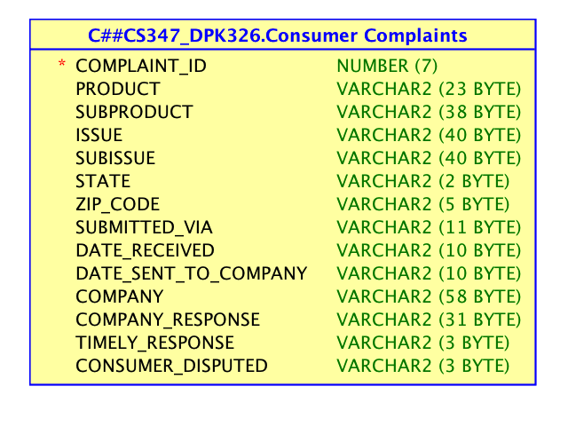

###Consumer Complaint Data by State
```ggplot(data = MYTABLE) + geom_histogram(aes(x = STATE))```


###Consumer Complaint Data by Products
```ggplot(data = MYTABLE) + geom_histogram(aes(x = PRODUCT))```


###Consumer Complaint Data by Submitted Via
```ggplot(data = MYTABLE) + geom_histogram(aes(x = SUBITTED_VIA))```


###Consumer Complaint Data by Company Response
```ggplot(data = MYTABLE) + geom_histogram(aes(x = COMPANY_RESPONSE))```


###Our UI.r 
```{r}
#Here is our code for the UI.r:
# ui.R

#shinyUI(fluidPage(
#  titlePanel("Consumer Complaints"),
  
#  sidebarLayout(
#    sidebarPanel(
#      helpText("Create demographic maps with 
#        information from the 2010 US Census."),

#     selectInput("var", 
#                  label = "Choose a variable to display",
#                  choices = c("Submitted Via", "Zip Code"),
#                  selected = "Percent"),
      
#      sliderInput("range",
#                  label = "Range of interest:",
#                  min = 0, max = 100, value = c(0, 100))
#    ),
    
#    mainPanel(plotOutput("map"))
#  )
#))

```

###Our Server.R
```{r}
#Here is our code for the Server.R
#server.R

#library(maps)
#library(mapproj)
#counties <- read.csv(data/cc.csv, header = TRUE, sep = ",", quote = "\"",
#                     dec = ".", fill = TRUE, comment.char = "#", ...)
#source("helpers.R")


#shinyServer(
#  function(input, output) {
#    output$map <- renderPlot({
#      args <- switch(input$var,
#                     "Submitted Via" = list(counties$white, "darkgreen", "% White"),
#                     "ZipCode" = list(counties$black, "black", "% Black"),
#      args$min <- input$range[1]
#      args$max <- input$range[2]
      
#      do.call(percent_map, args)
#    })
#  }
#)

```

###Our Shiny!
```{r}
#Here is a screen shot of our Shiny App
```
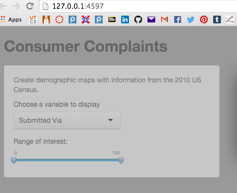

###Data Analysis

##Data Source
```
Financial Consumer Complaints 

“We list complaints in the database when the company responds to the complaints, which confirms a relationship with the consumer”
Consumer Financial Protection Bureau
```

##Types of debt collection complaints
```
Disclosure verification of debt
      -Did not receive notice of right to dispute, not enough information to verify debt, did not disclose communication was an attempt to collect a debt.

Communication tactics
      -Frequent or repeated calls, called outside of 8am-9pm, used obscene, profane or other abusive language, threatened to take legal action, called after sent written cease of communication notice.

False statements
      -Attempted to collect wrong amount, impersonated attorney, law enforcement or government official, indicated committing crime by not 
paying debt, indicated should not respond to lawsuit.

Improper contact or sharing of information
      -Contacted me after I asked not to, contacted my employer, contacted me instead of my attorney, talked to a third  party about my debt taking/threatening illegal action
      -Threatened to arrest or sue if payment is not made without properly notifying of lawsuit, sued me where I did not live, attempted to seize property

Continued attempts to collect debt not owed
      -Debt was discharged in bankruptcy, debt resulted from identity theft, debt was paid, debt is not mine
```

##Types of mortgage complaints
```
When you are unable to pay (Loan modification, collection, and foreclosure)
      -Consumers facing foreclosure have expressed concern and confusion about fees assessed in connection with the foreclosure process

Making payments (Loan servicing, payments, and escrow accounts) 
      -Consumers express concern over difficulties they experience when the servicing of their loans is transferred, including complaints about fees charged by the prior servicer, unexplained escrow deficiencies, issues with the new servicer accepting the previous servicer’s modification, and communication between the old and new servicer, especially when loss mitigation efforts are ongoing

Applying for a loan 
      -Consumers raise issues related to interest rate-lock agreements, such as lenders refusing to honor rate-locks, or assessing penalties when the loan does not close

Settling the agreement (settling process and costs)

Receiving a credit offer: credit decision and underwriting
```      

##Findings of Interest:

  - Debt collection complaints appear most often when submitted via web.
  - When complaints are submitted via referral, mortgage complaints are  
    substantially the highest.
  - Debt collection complaints concern unfair or hostile communication.
  - Mortgage complaints concern confusion over logistical issues.

  
      **Pictures**
      
      ```
      This is our final work flow from data miner.
      ```
      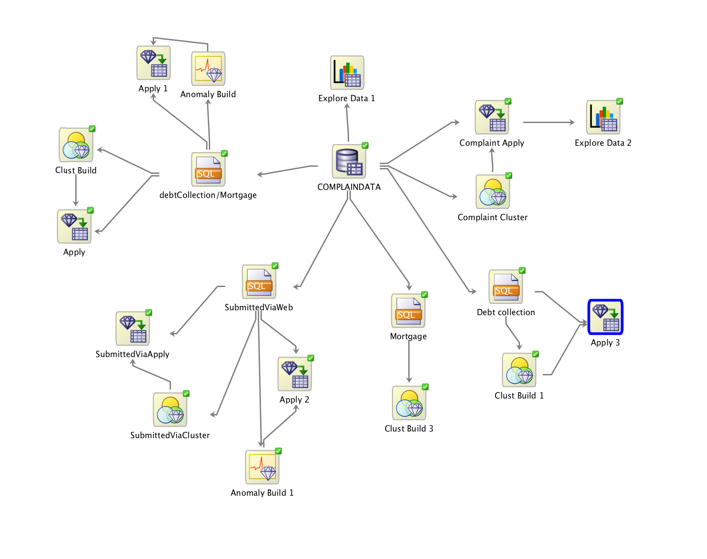
      
      
      ```
      This is 3 screen shots of our clusters:
            -Total complaint data cluster
            -Cluster of complaints filtered by phone referral
            -Shot of node 17 
      ```
      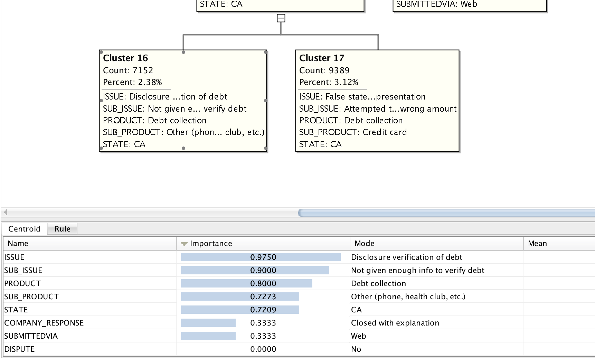
      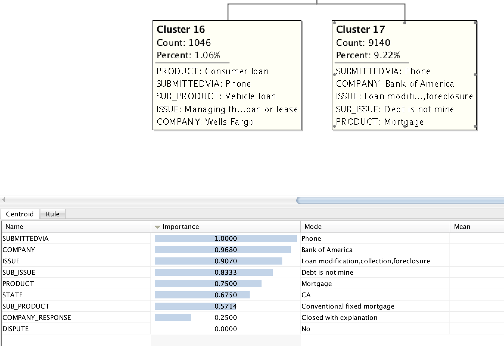
      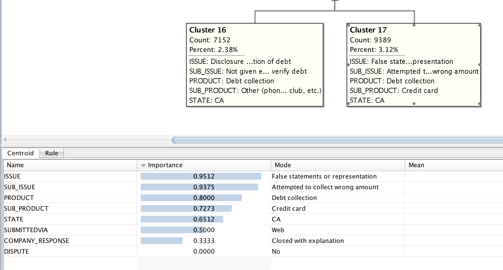


      ```
      This is debt collection cluster analysis
            -full cluster shot
            -debt collection filtered by state
            -debt collectin pie chart
      ```
      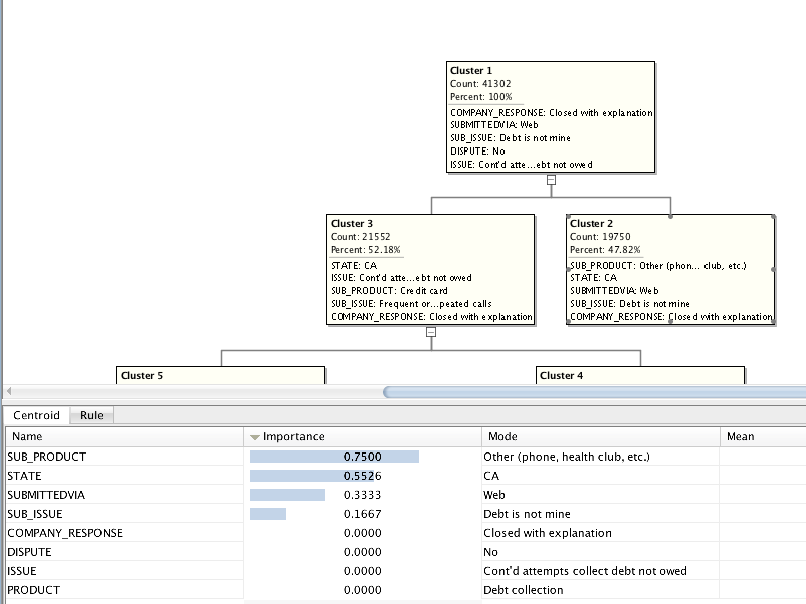
      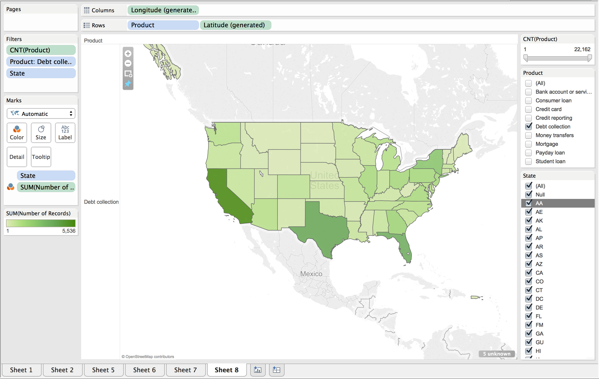
      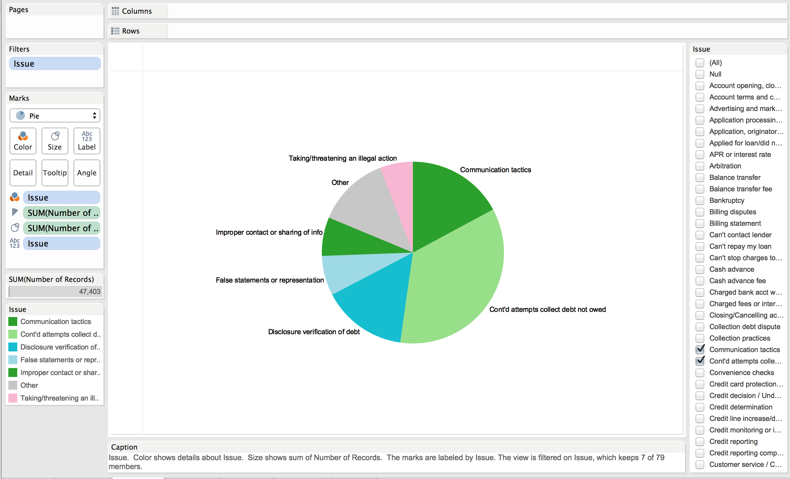
      
      
      ```
      This is a mortgage cluster analysis
            -mortgage cluster
            -mortgage pie chart
      ```
      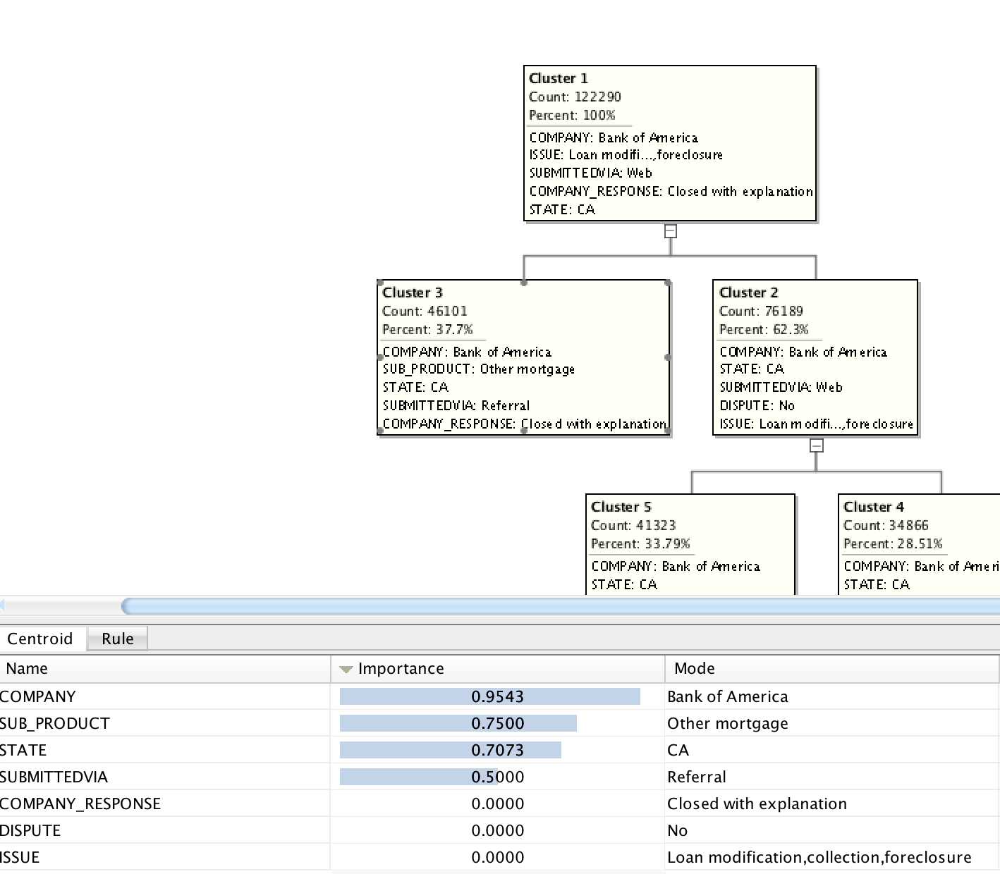
      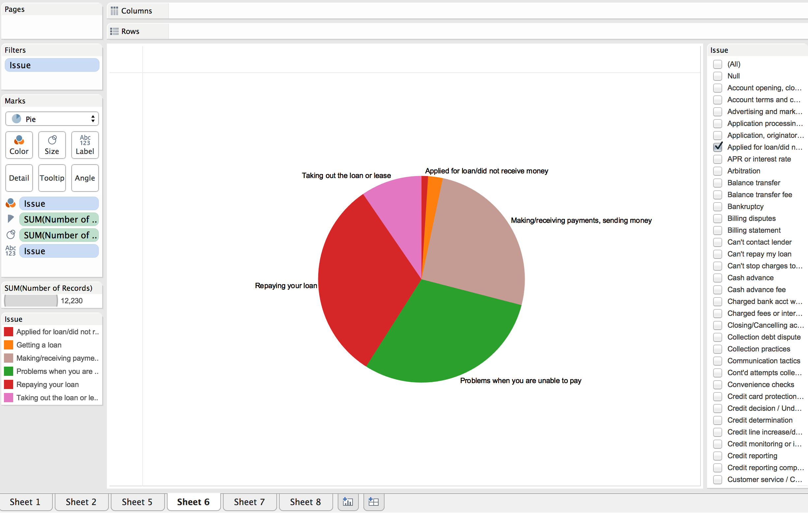
      
      
      ```
      This is data for specific traits for the number of records
            -by product
            -by submitted via
      ```
      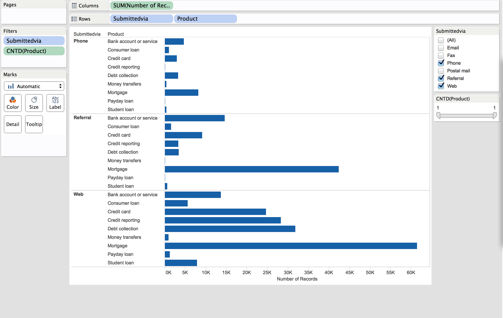
      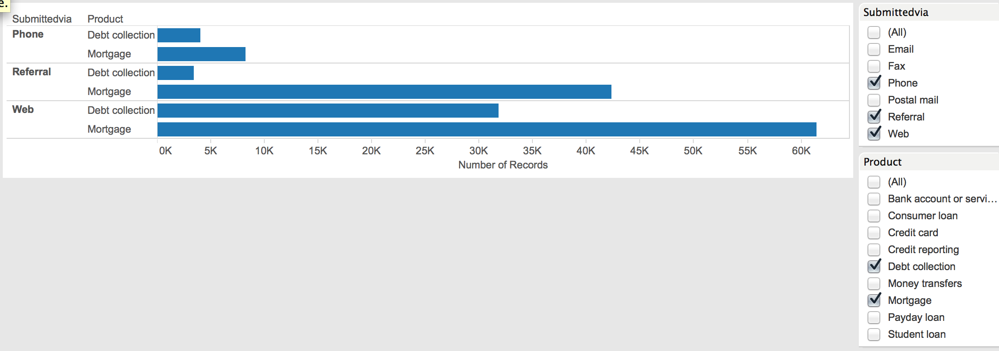
      
      
      ```
      This is submitted via data
            -our SQL statement to filter by submitted via referral
            -our SQL statement to filter by submitted via web
            -Submitted via cluster analysis
      ```
      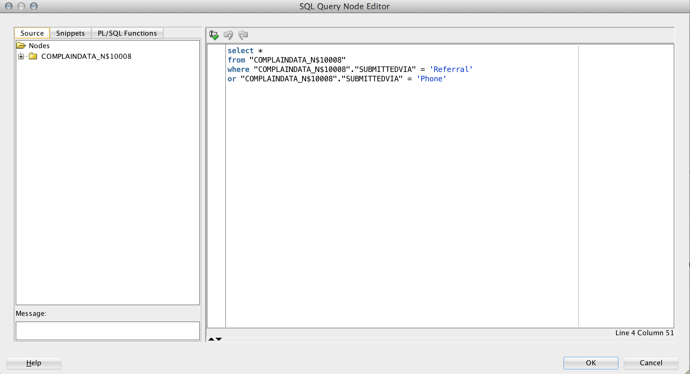
      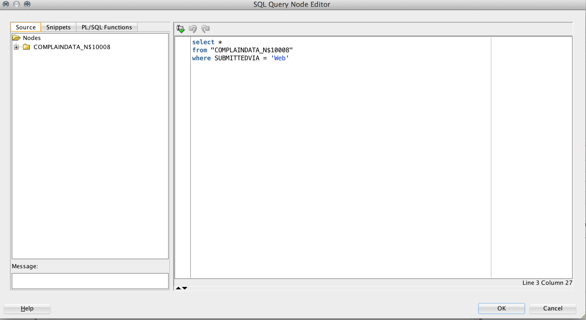
      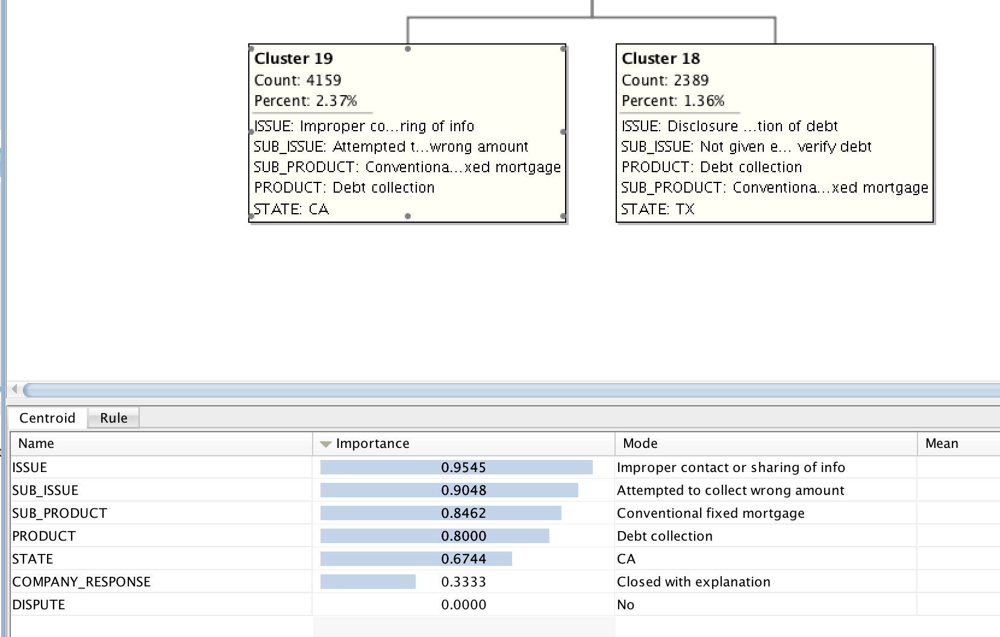
 
            
