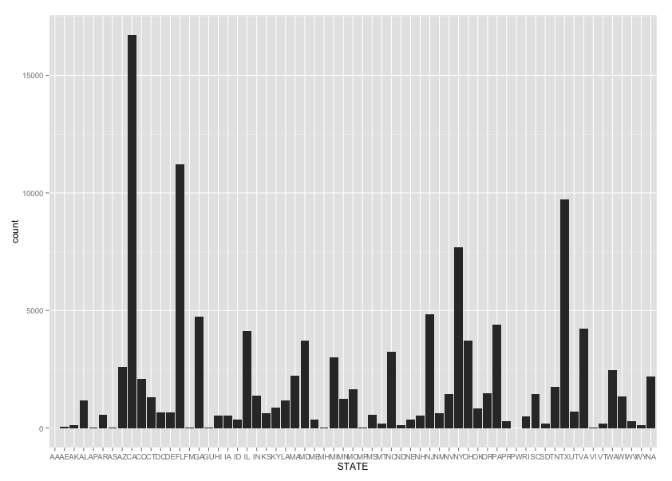
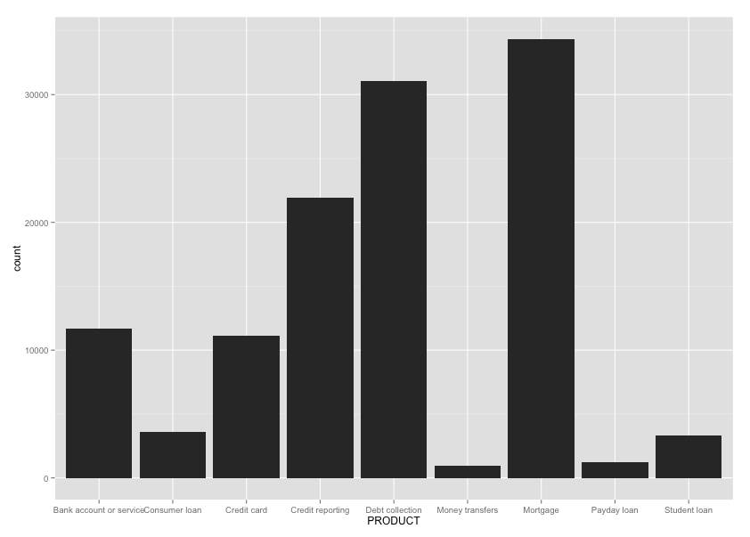
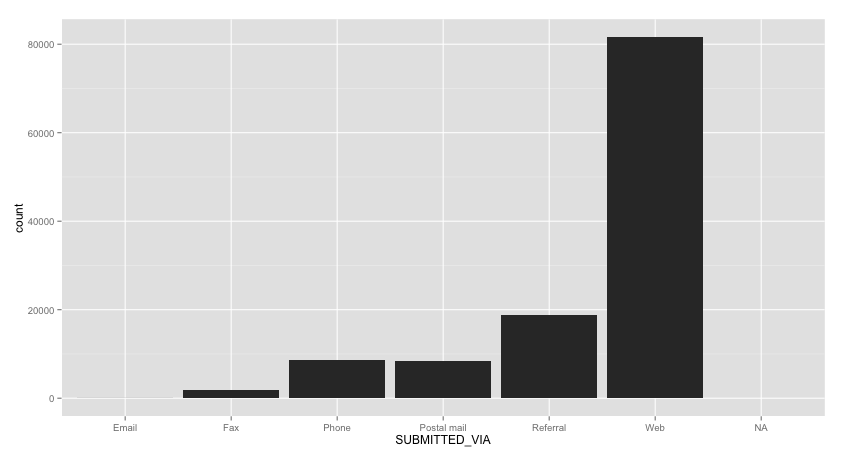
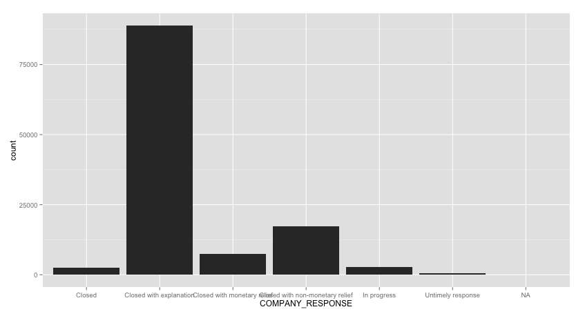

Consumer Complaints
==================

**Our data set is based on a collection of data based on consumer complaints from Bank companies over a 2 week period from 8/28/2013-9/10/2013. Our data includes state, zip code, complaint description and complaint ID, the method of submitted complaint, company name, date and date received by company and the company's response and whether or not if it was responded to in a timely fashion.**


###This is our we configured our R Studio
```{r}
sessionInfo()
```

###Our GitHub (Clone)
```Our GitHub repo to clone: https://github.com/annrushmi/CS378-Data-Science-.git ```

###This is our Rpofile configuration
```
Consumer_Complaints <- read.csv("~/Desktop/Consumer_Complaints.csv")
View(Consumer_Complaints)
library("ggplot2", lib.loc="/Library/Frameworks/R.framework/Versions/3.0/Resources/library")
library("RJDBC", lib.loc="/Library/Frameworks/R.framework/Versions/3.0/Resources/library")
library("knitr", lib.loc="/Library/Frameworks/R.framework/Versions/3.0/Resources/library")
```

###Basic R Language Constructs
```{r}
source("../01 Basic R/Basic.R", echo = TRUE)
```

###Consumer Complaint Data by State
```ggplot(data = MYTABLE) + geom_histogram(aes(x = STATE))```


###Consumer Complaint Data by Products
```ggplot(data = MYTABLE) + geom_histogram(aes(x = PRODUCT))```


###Consumer Complaint Data by Submitted Via
```ggplot(data = MYTABLE) + geom_histogram(aes(x = SUBITTED_VIA))```


###Consumer Complaint Data by Company Response
```ggplot(data = MYTABLE) + geom_histogram(aes(x = COMPANY_RESPONSE))```


###Our UI.r 
```{r}
#Here is our code for the UI.r:


```

###Our Server.R
```{r}
#Here is our code for the Server.R


```

###Our Shiny!
```{r}
#Here is a screen shot of our Shiny App
```